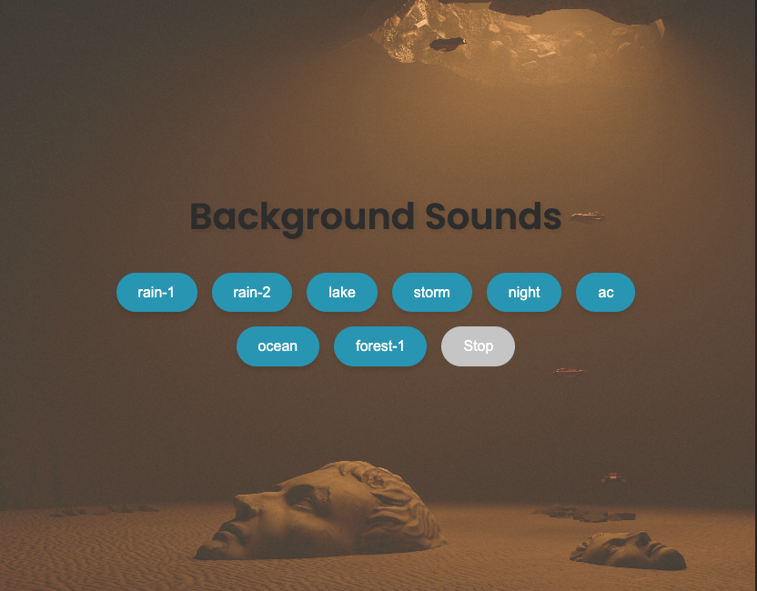

# 🎵 TheSoundWell

<p align="center">
  
</p>

## 🪩 Overview

I wanted to use something free of adds and without needing to add my
information. There are a lot of great apps, we should support them, BUT, I
wanted to create mine, this is for educational purposes. I'm, planning to add
more features soon. Sounds credits to [ZapSplat](https://www.zapsplat.com/)


## ✨ Features

- 🌧️ Play a variety of soothing background sounds (rain, fan, storm, night,
  ocean)
- ⏹️ Easily stop the current sound
- 🔉 Volume control
- 📱 Responsive design for seamless use across devices

## 🛠️ Technologies

- Vue.js 3
- HTML5/CSS3
- Web Audio API

## 📋 Prerequisites

Make sure you have:

- Installed the latest version of [Node.js and npm](https://nodejs.org/)

## 🚀 Getting Started

### Installation

1. Clone the repository:
   ```
   git clone https://github.com/Hckmar9/thesoundwell.git
   ```
2. Navigate to the project directory:
   ```
   cd thesoundwell
   ```
3. Install dependencies:
   ```
   npm install
   ```

### Usage

1. Launch the development server:
   ```
   npm run dev
   ```
2. Relax and enjoy 🎶

## 🤝 Contributing

All contributions are welcome!

## 📜 License

Sounds from here, full credit to them: [ZapSplat](https://www.zapsplat.com/)

This project is licensed under the
[MIT License](https://opensource.org/licenses/MIT).

---

Happy listening! 🎧
